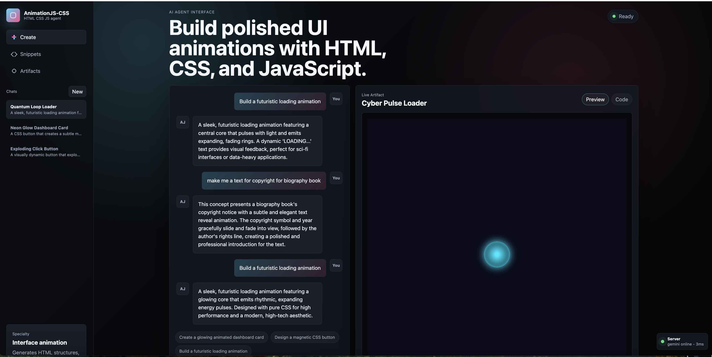

# AnimationJS-CSS



A Node.js AI agent interface for generating HTML, CSS, and JavaScript UI animations.

AnimationJS-CSS is a focused prototyping agent for turning natural-language prompts into working frontend animation artifacts. The existing app centers on an AI chat workflow: describe a card, loader, button, menu, dashboard widget, or interaction pattern, and the agent returns a structured artifact with HTML, CSS, and JavaScript that can be previewed live or inspected as code.

The interface includes saved chat history, prompt examples, theme controls, a live artifact preview, a code view, and a server health indicator. When Gemini is configured, prompts are sent to the Gemini API through the local Node.js backend. When no API key is available, the app falls back to a local generator so the interface remains usable for demos and development.

## Stack

- **Backend:** Node.js built-in `http`, `fs`, and `path` modules
- **AI provider:** Google Gemini API via `GEMINI_API_KEY` and `GEMINI_MODEL`
- **Frontend:** Vanilla HTML, CSS, and JavaScript
- **Styling:** Custom CSS with responsive layout, themes, animations, and live artifact styling
- **Storage:** Local JSON chat persistence in `data/chats.json`
- **Runtime:** `npm start` runs `server.js`

## Run

```sh
npm start
```

Open the printed local URL in your browser.

## Connect Gemini

Create a `.env` file in this folder:

```sh
GEMINI_API_KEY=your_gemini_api_key_here
GEMINI_MODEL=gemini-2.5-flash
```

Restart the server after changing `.env`.

The backend route is `POST /api/generate`. It sends your prompt to Gemini and expects a JSON artifact with:

- `title`
- `summary`
- `html`
- `css`
- `js`

If `GEMINI_API_KEY` is missing, the app uses a local fallback generator so the UI still works.
